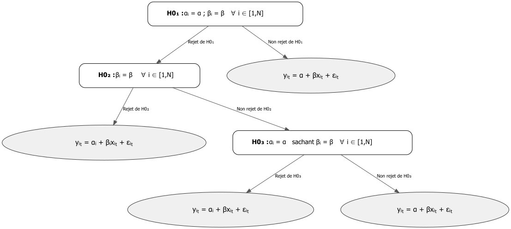

```{r}
#| eval: false
#| include: false
# A UTILISER POUR RENDER EN HTML ET PDF
quarto::quarto_render(
    here::here(
        "02-codes", 
        "presentations",
        "05-panel", 
        "05-panel.qmd"
    ), 
    output_format = "all"
)
```

# Théorie

## Définition des données de panel

Des données dites de "panel" sont des données qui suivent un échantillon d'individus à travers le temps. Ces données permettent d'avoir de multiples observations pour chaque individu de l'échantillon (**Hsiao 2003)**).

On utilisera l'indexation $i$ pour indiquer les individus (pays, régions, firmes...) et l'indexation $t$ pour indiquer les unités temporelles (années, mois...).

On notera donc :

$$
\begin{aligned}
  y_{it} \hspace{0.2cm} \forall \hspace{0.2cm} i = 1, \cdots, N \hspace{0.2cm} \text{; } \hspace{0.2cm} t = 1, \cdots, T
\end{aligned}
$$

## Avantages des données de panel

### Meilleure précision des estimateurs

Les données de panel permettent généralement d'obtenir un plus grand nombre de données que les données en temporelles ou en coupe transversales puisque les deux dimensions existent en panel. Le nombre d'observations disponibles pour des données de panel est de $(N \times T)$. Un plus grand nombre d'observations entraîne un plus grand nombre de degrés de libertés et une réduction de la colinéarité entre les différentes variables explicatives. Les données de panel sont ainsi censées permettre d'augmenter l'efficacité de l'analyse économétrique.

Cependant, plus d'observations n'implique pas nécessairement une augmentation de l'information. Les données de panel entraine en effet l'apparition de nouveaux biais, comme le biais d'hétérogénéité, qu'il faut prendre en compte.

### Prise en compte de l'hétérogénéité

Les données de panel permettent de contrôler (dans une certaine mesure) pour des variables qui ne sont pas observables ou mesurables telles que les différences culturelles, pratiques commerciales, politiques nationales, crises globales etc... Ces données permettent de prendre en compte **l'hétérogénéité individuelle et/ou temporelle**.

Enfin, les données de panel permettent également d'inclure des variables à différents niveaux d'analyse (étudiants, écoles, état etc...) permettent ainsi des analyses multi-niveaux.

Considérons le modèle de régression suivant :

$$
\begin{aligned}
  y_{it} = \alpha + \beta^{'} x_{it} + \rho^{' }z_{it} + \epsilon_{it}  
\end{aligned}
$$ Où : - $i = 1, \cdots, N$ - $t = 1, \cdots, T$ - $x_{it}$ et $z_{it}$ sont des variables exogènes - $\alpha$, $\beta$ et $\rho$ sont des paramètres - $\varepsilon_{it}$ est le vecteur d'erreurs du modèle. Les erreurs sont $i.i.d$ à travers les dimensions individuelles et temporelles avec $V(\varepsilon_{it}) = \sigma^2_\varepsilon$.

Supposons, que la variable $z_{it}$ n'est pas observable et est corrélée d'une manière quelconque avec la variable $x_{it}$ :

$$
\begin{aligned}
  cov(x_{it} \hspace{0.1cm} , \hspace{0.1cm} z_{it}) \neq 0  
\end{aligned}
$$ Dans un tel cas, le modèle estimé devient :

$$
\begin{aligned}
  y_{it} &= \alpha + \beta^{'} x_{it} + u_{it} \\
  u_{it} &= \rho^{' }z_{it} + \varepsilon_{it}
\end{aligned}
$$ Puisque la variable $x_{it}$ est corrélée avec la variable $z_{it}$ ($cov(x_{it} \hspace{0.1cm} , \hspace{0.1cm} z_{it}) \neq 0$) contenue désormais dans le terme d'erreur $u_{it}$, ce terme d'erreur devient corrélé avec la variable $x_{it}$ :

$$
\begin{aligned}
  cov(x_{it} \hspace{0.1cm} , \hspace{0.1cm} u_{it}) \neq 0  
\end{aligned}
$$

Le coefficient $\beta$ est donc biaisé puisque l'hypothèse d'exogénéité ne tient plus.

Si l'on suppose maintenant que $z_{it} = z_i$, c'est à dire que les valeurs de $z$ sont constantes dans le temps pour chaque individu, mais diffèrent entre chaque individu, alors le modèle devient :

$$
\begin{aligned}
  &y_{it} = \alpha + \beta^{'} x_{it} + u_{it} \\
  &u_{it} = \rho^{' }z_{i} + \varepsilon_{it} \\
  &cov(x_{it} \hspace{0.1cm} , \hspace{0.1cm} u_{it}) \neq 0 
\end{aligned}
$$

Il est possible de purger l'effet inobservé de la variable $z_i$ en prenant la première différence de chaque individu à travers le temps :

$$
\begin{aligned}
  y_{it} - y_{i,t-1} &= \beta^{'} \left( x_{i,t} - x_{i,t-1} \right) + u_{i,t} - u_{i,t-1} \\
  u_{i,t} - u_{i,t-1} &= \rho^{' }z_i - \rho^{' } z_i + \varepsilon_{i,t} - \varepsilon_{i,t-1} = \varepsilon_{i,t} - \varepsilon_{i,t-1}
\end{aligned}
$$ Puisque $z_i$ est invariant dans le temps, $z_{i,t} = z_{i,t-1} = z_i$. Prendre la première différence temporelle pour chaque individu permet de purger l'effet de $z_i$ pour chaque individu et ainsi prendre en compte une variable inobservable qui aurait biaiser notre modèle.

Il est possible de mener l'exact même raisonnement dans le cas où $z$ serait le même entre tous les individus pour chaque période de temps, mais varierait à chaque période temporelle : $z_{i,t} = z_t$. La variable $z_t$ est appelée **facteur commun**. Le modèle devient :

$$
\begin{aligned}
  &y_{it} = \alpha + \beta^{'} x_{it} + u_{it} \\
  &u_{it} = \rho^{' }z_{t} + \varepsilon_{it} \\
  &cov(x_{it} \hspace{0.1cm} , \hspace{0.1cm} u_{it}) \neq 0 
\end{aligned}
$$

Pour prendre en compte cet effet inobservé, il suffit de prendre la différence entre la valeur observée et la moyenne entre les individus pour chaque période de temps :

$$
\begin{aligned}
  &y_{i,t} - \bar{y}_t = \beta^{' } \left( x_{i,t} - \bar{x}_t \right) + u_{i,t} - \bar{u}_t \\
  &u_{i,t} - \bar{u}_t = \rho^{' } z_t - \rho^{' } \bar{z}_t + \varepsilon_{i,t} + \bar{\varepsilon}_t = \varepsilon_{i,t} + \bar{\varepsilon}_t
\end{aligned}
$$ Avec : $\bar{y}_t = \frac{1}{N} \sum_{i=1}^N y_{i,t}$, $\bar{x}_t = \frac{1}{N} \sum_{i=1}^N x_{i,t}$, $\bar{u}_t = \frac{1}{N} \sum_{i=1}^N u_{i,t}$ et $\bar{\varepsilon}_t = \frac{1}{N} \sum_{i=1}^N \varepsilon_{i,t}$.

Puisque $z_t$ est constant entre les individu pour une période $t$ donnée, on a $\bar{z}_t = \frac{1}{N} \sum_{i=1}^N z_{t} = \frac{1}{N} \times N \times  z_t = z_t$. En prenant la différence à la moyenne entre les individus, on purge donc du facteur commun inobservé $z_t$.

Il est évidemment possible de combiner les deux approches pour purger des facteurs invariants dans le temps et des facteurs communs entre les individus.

### Stationnarité

#### Tests de racines unitaires

Dans le cas de panel où la dimension $T$ est large (grand nombre de périodes temporelles), la stationnarité redevient un enjeu tout comme pour les séries temporelles. Les données de panel vont cependant présenter un certain nombre d'avantages comparé aux séries temporelles.

Le premier avantage est l'ajout de la dimension individuelle à la dimension temporelle qui permet d'augmenter la **puissance** des tests de racines unitaires sur de petits échantillon (d'avantages de degrés de liberté par rapport aux séries temporelles). Le problème de pettis échantillons en séries temporelles peut être combattu en augmentant la période d'études, mais cela suppose de prendre le risque d'avoir affaire à des changements de régimes ou des breaks structurels.

Les données de panel permettent d'augmenter l'information en incluant l'information de différents individus sans pour autant forcément augmenter la dimension temporelle. On peut donc travailler plus facilement sur de plus petits échantillons temporels.

Un autre avantage est que dans le cadre de données de panel, les statistiques des tests de racines unitaires vont admettre pour loi asymptotique des lois normales (bien que restant conditionné au modèle utilisé) évitant l'utilisation de tables de lois particulières.

Les données de panel permettent de prendre également en compte l'hétérogénéité dans la présence des racines unitaires.

#### Régressions fallacieuses

En séries temporelles, lorsque l'on régresse une variable non-stationaire sur un ensemble de variable non-stationaire non cointégrées, cela conduit à des régressions fallacieuses (coefficients qui paraissent hautement significatifs à tord) puisque l'estimateur MCO converge en probabilité vers une variable aléatoire et non plus une constante (et est biaisé). De plus, la distribution statistique de Student associée au tests de nullité du paramètre du modèle de régression est divergente avec la dimmension $T$ : elle ne converge pas lorsque $T$ augmente. Cela conduit à rejeter à tord la nullité du paramètre et donc à trouver un effet quand il ne devrait pas y en avoir.

En panel, le problème de régression fallacieuse est moins important qu'en séries temporelles. En panel, les estimateurs usuels convergent en probabilité vers la vraie valeur du paramètre même si l'on régresse des variables non-stationaires et non-cointégrées entre elles.

Le problème reste cependant toujours d'actualité pour l'inférence. En présence de régression fallacieuse en panel, les statistiques de test usuelles ont des distributions divergentes tout comme en séries temporelles.

## Types d'hétérogénéité pris en compte

### Aucune hétérogénéité

Les données de panel permettent d'inclure différents niveaux d'hétérogénéité au sein du modèle. Le modèle dit **pooled** va être un modèle dans lequel il n'existe pas d'hétérogénéité entre les agents et entre les périodes temporelles. La relation est identique pour tous les agents et toutes les périodes de temps et il n'existe ni facteurs commun ni facteurs individuels.

$$
\begin{aligned}
  y_{i,t} = \alpha + \beta x_{i,t} + \varepsilon_{i,t}  
\end{aligned}
$$ Il existe une relation linéaire entre $y$ et $x$ caractérisée par $\beta$. Lorsque $x_{i_t} = 0$, $y_{it} = \alpha$.

```{r echo=FALSE}
source(here::here("02-codes", "presentations", "05-panel", "code", "graph_model_pooled.R"))
```

### Hétérogénéité individuelle et/ou temporelle

Comme nous avons pu le voir, les modèles de panel permettent de prendre en compte les caractéristiques propres aux individus qui ne varient pas dans le temps, ainsi que les facteurs communs qui affectent tous les individus de la même manière à une période donnée.

$$
\begin{aligned}
  y_{i,t} = \alpha_i + \beta x_{i,t} + \varepsilon_{i,t}   
\end{aligned}
$$ Dans ce modèle, les effets invariants dans le temps mais propres à chaque individu sont représentés par le terme $\alpha_i$. Il s'agit tout simplement d'une différence systématique entre chaque individu. Cependant la relation entre la variable $x$ et la variable $y$ reste la même pour tous les individus : $\beta$. Chaque individu est caractérisé par une ordonnée à l'origine différente, maios la pente de la droite reste la même.

```{r graph FE, echo=FALSE}
source(here::here("02-codes", "presentations", "05-panel", "code", "graph_model_FE_indiv.R"))
```

Le principe est identique pour les facteurs communs qui varient dans le temps, mais sont identiques pour chaque individus.

$$
\begin{aligned}
  y_{i,t} = \lambda_t + \beta x_{i,t} + \varepsilon_{i,t}   
\end{aligned}
$$ Il faut voir $\lambda_t$ comme une ordonnée à l'origine spécifique pour chaque unité temporelle. Encore une fois, la force de la relation reste identique à chaque période de temps : $\beta$.

On peut évidemment inclure les facteurs invariants dans le temps et les facteurs commun au sein d'un même modèle :

$$
\begin{aligned}
  y_{i,t} = \alpha_i + \lambda_t + \beta x_{i,t} + \varepsilon_{i,t}   
\end{aligned}
$$ Les interprétations de $\alpha_i$ et $\lambda_t$ restent inchangées.

### Hétérogénéité totale

Finalement, il est possible d'avoir une hétérogénéité dans les constantes (individuelles et/ou temporelles) mais également il est possible que la relation entre $x$ et $y$ change entre les individus. La pente de la droite va dès lors dépendre de l'individu en question.

$$
\begin{aligned}
  y_{i,t} = \alpha_i  + \beta_i x_{i,t} + \varepsilon_{i,t}   
\end{aligned}
$$ Dans ce modèle, il y a des effets invariants dans le temps et spécifiques à chaque individu ($\alpha_i$), mais la pente (la force) de la relation liant $x$ à $y$ diffère également entre les individus. Il n'y a plus une relation unique. Il y a une relation par individu.

```{r graph heterogeneous total, echo=FALSE}
source(here::here("02-codes", "presentations", "05-panel", "code", "graph_model_heterogeneous.R"))
```

La représentation graphique ci-dessus nous montre que globalement la relation entre $x$ est $y$ est positive pour tous les individus à l'exception de l'individu 4 pour lequel la relation est négative. Il pourrait s'agir d'un individu qui n'appartient pas réellement au groupe étudié, ou alors il s'agit d'un outlier, d'un individu exceptionnel.

## Biais d'hétérogénéité

Si les modèles de panel sont capables de prendre en compte différents niveaux d'hétérogénéité, cela signifie que si cette hétérogénéité n'est pas correctement prise en compte, elle est susceptible de biaiser nos estimations et de les rendre sans intérêt.

Suppoons que le modèle de la population comporte un paramètre de pente identique pour tous les individus, mais que des effects invariants dans le temps impactent chaque individu de manière différente :

$$
\begin{aligned}
  y_{i,t} = \alpha_i + \beta x_{i,t} + \varepsilon_{i,t} 
\end{aligned}
$$ Supposons maintenant, que l'on utilise not $NT$ observations pour estimer le modèle pooled suivant :

$$
\begin{aligned}
  y_{i,t} = \alpha + \beta x_{i,t} + u_{i,t}   
\end{aligned}
$$ Si les effets individuels $\alpha_i$ sont corrélés avec $x_{i,t}$, alors les omettre dans l'estimation va biaiser $\beta$.

```{r graph heterogeneity bias, echo=FALSE}
source(here::here("02-codes", "presentations", "05-panel", "code", "graph_heterogeneity_bias.R"))
```

Le graphique ci-dessus montre que la relation entre les variables $x$ et $y$ est négative si l'on distingue correctement l'effet individuel de chaque individu. Ils sont gouvernés par la même relation, mais des effets individuels invariants dans le temps entraînent des différences systématiques entre les différents individus. Si ces effets individuels ne sont pas pris en compte (en faisant un modèle pooled par exemple), la relation estimée sera une relation fortement positive alors même que la vraie relation dans la population est négative (il s'agit ici d'un cas extrême).

Il faut donc faire attention à correctement modéliser l'hétérogénéité dans un modèle avec des données de panel.

## Estimateur Pooled OLS

L'estimateur Pooled OLs (POLS) est un estimateur qui suppose qu'il n'y a pas d'hétérogénéité entre les différents individus et les différentes périodes du modèle. Le modèle à estimer est donc le modèle suivant :

$$
\begin{aligned}
  y_{i,t} = \alpha + \beta^{'} x_{i,t} + \varepsilon_{i,t}  
\end{aligned}
$$ L'estimation d'un modèle pooled revient à effectuer une régression par les MCO classiques, simplement augmenté avec la dimension temporelle.

Les estimateurs sont donnés par la formule suivante :

$$
\begin{cases}
  \hat{\beta}_{\text{OLS}} &= \left[ \sum_{i=1}^N \sum_{t=1}^T \left( x_{i,t} - \bar{x} \right) \left( x_{i,t} - \bar{x} \right)^{'}   \right]^{-1} \left[ \sum_{i=1}^N \sum_{t=1}^T \left( x_{i,t} - \bar{x} \right) \left( y_{i,t} - \bar{y} \right)^{' } \right] \\[2ex]
  \hat{\alpha}_{\text{OLS}} &= \bar{y} - \hat{\beta}_{\text{OLS}} \times \bar{x}
\end{cases}
$$

Avec :

-   $\bar{x} = \frac{1}{NT}\sum_{i=1}^N \sum_{t=1}^T x_{i,t}$

-   $\bar{y} = \frac{1}{NT}\sum_{i=1}^N \sum_{t=1}^T y_{i,t}$

L'estimateur POLS est non-biaisé et consistant si $x_{i,t}$ est strictement exogène (non-corrélé de quelconque manière que ce soit avec le terme d'erreur) et si les constantes sont réellement homogènes. En cas d'hétérogénéité des constantes (et dans le cas où elles sont corrélées avec $x_{i,t}$), alors l'estimateur POL est biaisé.

Comme pour une estimation OLS classique, la présence d'hétéroscédasticité (variance nonc-constante des erreurs) ou d'auto-corrélation des erreurs n'affecte pas le biais de l'estimateur. Cela impact l'inférence en rendant la variance de l'estimateur non-minimale. Dans de tels cas des correction (White, Newey-West, etc...) peuvent être appliquées sur la matrice de variance-covariance.

## Estimateur LDSV / Effets Fixes

### Définition de l'estimateur

Considérons maintenant le cas où le modèle dans la population est caractérisé par des différences individuelles invariantes dans le temps, mais où la relation reste la même entre les individus et les périodes temporelles :

$$
\begin{aligned}
  y_{i,t} = \alpha_i + \beta^{'} x_{i,t} + \varepsilon_{i,t}  
\end{aligned}
$$ Nous supposons également que les effets individuels sont corrélés d'une quelconque manière que ce soit avec la variable explicative $x_{i,t}$ :

$$
E(\alpha_i | x_{i,1}, \cdots, x_{i,T}) \neq 0
$$

#### Estimateur LSDV

Dans ce cas ne pas modéliser ces différences individuelles entraînera un biais dans l'estimateur. On ne peut donc pas utiliser l'estimateur Pooled, qui omet complètement ces effets individuels, ni l'estimateur à effets aléatoires qui considère ces effets individuels comme étant des variables aléatoires présentes dans le terme d'erreur.

L'idée derrière l'estimateur à effets fixe revient à inclure une variable binaire par individu qui prend la valeur 1 quand il s'agit de l'individu concerné et la valeur 0 sinon. L'estimation est ensuite une estimation OLS classique. Cependant, inclure une dummy par individu peut être fastidieux et peu efficace.

Pour éviter cela, on peut transformer l'écriture du modèle précédent pour ne garder une écriture qui ne dépend que de la dimension individuelle. On obtient ainsi une équation par individu que l'on peut par la suite regrouper.

$$
\begin{aligned}
  y_i = e\alpha_i + X_i\beta + \varepsilon_i \quad \forall \hspace{0.2cm} i = 1, ..., N  
\end{aligned}
$$ Avec :

$$
\begin{aligned}
  \underset{(T,1)}{y_i} &= \left( \begin{array}{cccc} \mathbf{y}_{i,1} & \mathbf{y}_{i,2} & ... & \mathbf{y}_{i,T} \end{array} \right)' \\[2ex]
\underset{(T,1)}{\varepsilon_i} &= \left( \begin{array}{cccc} \varepsilon_{i,1} & \varepsilon_{i,2} & ... & \varepsilon_{i,T} \end{array} \right)' \\[2ex]
\underset{(T,1)}{e} &= \left( \begin{array}{cccc} 1 & 1 & ... & 1 \end{array} \right)' \\[2ex]
\underset{(T,K)}{X_i} &= \left( \begin{array}{cccc}
x_{1,i,1} & x_{2,i,1} & ... & x_{K,i,1} \\
x_{1,i,2} & x_{2,i,2} & ... & x_{K,i,2} \\
... & ... & ... & ... \\
x_{1,i,T} & x_{2,i,T} & ... & x_{K,i,T}
\end{array} \right) \Leftrightarrow \underset{(T,K=1)}{X_i} = \left( \begin{array}{cccc}
x_{1,i,1}  \\
x_{1,i,2}  \\
... \\
x_{1,i,T} 
\end{array} \right)  
\end{aligned}
$$ La minimisation de la somme des carrés des résidus de ce modèle donne les estimateurs LSDV suivant :

$$
\begin{cases}
  \hat{\beta}_{\text{LSDV}} = \left[ \sum_{i=1}^N \sum_{t=1}^T \left( x_{i,t} - \bar{x}_i \right) \left( x_{i,t} - \bar{x}_i \right)^{' } \right]^{-1} \left[ \sum_{i=1}^N \sum_{t=1}^T \left( x_{i,t} - \bar{x}_i \right) \left( y_{i,t} - \bar{y}_i \right)^{' } \right] \\[2ex] 
  \hat{\alpha}_i = \bar{y}_i - \hat{\beta}_{\text{LSDV}}^{'} \bar{x}_i
\end{cases}
$$

Avec :

$$
\begin{aligned}
  \bar{x}_i = \frac{1}{T} \sum_{i=1}^T x_{i,t} \quad \text{;} \quad \bar{y}_i = \frac{1}{T} \sum_{i=1}^T y_{i,t}  
\end{aligned}
$$

L'estimateur Least Square Dummy Variable (LSDV) correspond à un OLS classique dans lequel on a inclu une variable dummy pour chaque individu. On obtient donc une ordonnée à l'origine par individu. On peut voir que la différence par rapport à l'estimateur POLS est que l'écart est estimé par rapport à la moyenne (temporelle) de chaque individu et non plus à une moyenne globale.

L'estimateur LSDV permet de récupérer l'information de la valeur de la constante pour chaque individu. Cependant, lorsque le nombre d'individu grandi, estimer l'ensemble des constante peut être computationnellement inefficient, voir inutile selon la question de recherche.

#### Estimateur à Effets fixes / Within

L'estimateur par Effets fixes va transformer le modèle initial pour supprimer les effets individuels avant d'estimer les coefficients de pente $\beta$.

L'idée derrière l'estimateur à effets fixes est d'estimer $\beta$ après avoir éliminer les effets individuels $\alpha_i$ en soustrayant à chaque valeur $x_{i,t}$ la moyenne (temporelle) de chaque individu $\bar{x}_{i}$.

Le modèle devient donc:

$$
\begin{aligned}
  &y_{i,t} - \bar{y}_t = (\alpha_i - \alpha_i) + \beta^{' } \left( x_{i,t} - \bar{x}_t \right) + (\varepsilon_{i,t} + \bar{\varepsilon}_t)
\end{aligned}
$$

Et on peut appliquer l'estimateur Pooled OLS sur ces nouvelles données.

Au lieu de modifier les données puis d'estimer le modèle, on peut également modifier l'estimateur pour prendre en compte cette modification à effectuer.

Pour cela, on va considérer une matrice de taille $T \times T$ idempotent notée $Q$ telle que :

$$
\begin{aligned}
  Q = I_T -  \frac{1}{T}ee^{'}  
\end{aligned}
$$ Il s'agit d'une matrice de transition (appelée opérateur within) qui permet de mesurer les observations par rapport à leur moyennes individuelles (pour chaque individu on fait la moyenne de toutes ses périodes temporelles). Cette matrice est dite idempotente c'est à dire que $Q \times Q = Q$ et $Q^{'} = Q$.

On va prémultiplier chaque équation individuelle par cette matrice $Q$, ce qui donne l'équation suivante :

$$
\begin{aligned}
  Qy_i = Qe\alpha_i + QX_i\beta + Q\varepsilon_i \quad \forall \hspace{0.2cm} i = 1, ..., N  
\end{aligned}
$$ On peut montrer que cela revient à mesurer les variables comme des déviations par rapport à leur moyenne individuelle :

$$
\begin{aligned}
  Q y_i &= \left( I_T - \frac{1}{T} e e' \right) y_i \\[2ex]
 \Leftrightarrow Q y_i    &= y_i - \left( \frac{1}{T} ee' y_i \right) \\[2ex]
 \Leftrightarrow Q y_i    &= y_i - e \left( \frac{1}{T} e' y_i \right) \\[2ex]
 \Leftrightarrow Q y_i    &= \begin{pmatrix} 
         y_{i,1} \\ 
         y_{i,2} \\ 
         \dots \\ 
         y_{i,T} 
         \end{pmatrix} 
         - \frac{1}{T} \left[ \begin{pmatrix} 
         1 & 1 & \cdots & 1 \\ 
         \end{pmatrix} \begin{pmatrix} 
         y_{i,1} \\ 
         y_{i,2} \\ 
         \dots \\ 
         y_{i,T} 
         \end{pmatrix} \right] 
         \begin{pmatrix} 
         1 \\ 
         1 \\ 
         \dots \\ 
         1 
         \end{pmatrix} \\[2ex] \\
 \Leftrightarrow Q y_i    &= y_{i,t} - \left( \frac{1}{T} \sum_{t=1}^T y_{i,t} \right) \\[2ex]
 \Leftrightarrow Q y_i    &= y_{i,t} - \bar{y}_i \\[2ex]
 \Leftrightarrow Q y_i    &= \begin{pmatrix} 
         y_{i,1} - \bar{y}_i \\ 
         y_{i,2} - \bar{y}_i \\ 
         \dots \\ 
         y_{i,T} - \bar{y}_i 
         \end{pmatrix}
\end{aligned}
$$

Appliquer la matrice $Q$ au vecteur $e$ qui est constant (ou appliquer la matrice $Q$ à une variable invariante dans le temps) revient au vecteur nul puisque :

$$
\begin{aligned}
  Q e &=  \left( I_T - \frac{1}{T}ee^{'} \right)e \\[2ex]
  \Leftrightarrow Qe &= e - \frac{1}{T}ee^{'}e \\[2ex]
  \Leftrightarrow Qe &= e - \frac{T}{T}e \\[2ex]
  \Leftrightarrow Qe &= e - e \\[2ex]
  \Leftrightarrow Qe &= 0
\end{aligned}
$$

Les variables/effets invariants dans le temps sont donc supprimés (puisqu'on leur retire leur moyenne qui est égale à leur valeur).

L'équation devient donc :

$$
\begin{aligned}
  Qy_i &= Qe\alpha_i + QX_i\beta + Q\varepsilon_i \\[2ex]
  \Leftrightarrow Qy_i &= QX_i\beta + Q\varepsilon_i   \quad \forall \hspace{0.2cm} i = 1, ..., N  
\end{aligned}
$$

A partir de cette transformation on peut donc définir l'estimateur Whithin/Effet fixe (FE) comme l'estimateur OLS classique avec l'ajout de la matrice $Q$ :

$$
\begin{aligned}
  \hat{\beta}_{\text{FE}} = \left( X^{' }QX \right)^{-1} \left( X^{' }QY \right)  
\end{aligned}
$$

Ou encore :

$$
\begin{aligned}
  \hat{\beta}_{\text{FE}} = \left[ \sum_{i=1}^N X_i^{' }Q X_i \right]^{-1} \left[ \sum_{i=1}^N X_i^{' }QY_{i}\right]  
\end{aligned}
$$ La variance de l'estimateur à effet fixe est également similaire à la variance OLS classique :

$$
\begin{aligned}
  V \left( \hat{\beta}_{\text{FE}} \right) = \sigma_{\varepsilon}^2 \left[ \sum_{i=1}^N X_i^{' }Q X_i \right]^{-1}   
\end{aligned}
$$ Il est important de noter que les méthodes LSDV ou FE donnent les mêmes estimations des paramètres de pente $\beta$ :

$$
\begin{aligned}
  \hat{\beta}_{\text{LSDV}} = \hat{\beta}_{\text{FE}} = \hat{\beta}_{\text{Within}} 
\end{aligned}
$$ L'estimateur $\hat{\beta}_{\text{LSDV}}$ permettra d'obtenir des estimations pour les effets individuels invariants dans le temps $\alpha_i$ qu'il suffira d'interpréter comme une variable binaire classique en référence à un individu de référence. L'estimateur FE (Within) ne donnera que l'estimation des paramètres de pente $\beta$.

#### Estimateur Two Ways Fixed Effect

On peut généraliser le modèle à effets fixes pour inclure également effets temporels spécifiques qui ne varient pas entre les individus. On considère ainsi le modèle suivant :

$$
\begin{aligned}
  y_{i,t} = \alpha_i + \lambda_t + \beta x_{i,t} + \varepsilon_{i,t}   
\end{aligned}
$$ On peut introduire une variable binaire pour chaque individu et une variable binaire pour chaque période temporelle : $(N \times T)$ variables binaires, ou bien on peut comme pour l'estimateur FE, procéder à une transformation des variables telles que :

$$
\begin{aligned}
  \tilde{y} &= (y_{i,t} - \bar{y}_i - \bar{y}_t + \bar{y}) \\[2ex]
  \tilde{x} &= (x_{i,t} - \bar{x}_i - \bar{x}_t + \bar{x})
\end{aligned}
$$ On va retrancher à chaque variable sa moyenne individuelle, sa moyenne temporelle et ajouter la moyenne globale individuelle et temporelle. Il ne reste plus qu'à estimer le modèle à partir de l'estimateur Pooled OLS.

**Il est très important de noter que lorsque l'on utiliser un modèle à effets fixes, qu'il soit one way ou two ways, il n'est pas possible d'estimer les coefficients relatifs à des variables invariantes dans la dimension de l'effet fixe. Ces effets invariants se retrouveront dans les coefficients des variables binaires.**

### Hypothèses et propriétés

Pour que les estimateurs LSDV/FE aient les bonnes propriétés, certaines hypothèses doivent être respectée.

L'hypothèse d'exogénéité est toujours présente. Les variables explicatives ne doivent être corrélées d'aucune manière que ce soit avec le terme d'erreur :

$$
\begin{aligned}
  E(u_{i,t} | x_{i,t}) = 0  
\end{aligned}
$$ Si cette hypothèse est respectée, alors les estimateurs sont sans biais. Egalement, l'hétérogénéité doit être correctement spécifiée. Si le vrai modèle comporte des effets fixes individuels et temporels, omettre l'un des deux dans l'estimation donnera lieu à des coefficients biaisés et inconsistants.

Tout comme un modèle OLS classique, on va placer des hypothèses sur le terme d'erreur. Outre sa supposée normalité, les erreurs du modèle doivent être de moyenne nulle, de variance constante à travers le temps, ne doivent pas être auto-corrélées dans le temps et ne doivent pas être corrélées entre les individus (l'erreur d'un individu spécifique ne doit pas être corrélée avec l'erreur d'un autre individu). ce jeu d'hypothèse est noté de la manière suivante :

$$
\begin{aligned}
    &E (\varepsilon_{i,t}) = 0 \\[2ex]
    &E (\varepsilon_{i,t}\varepsilon_{i,s}) = 
    \begin{cases} 
        \sigma_{\varepsilon}^2 & t = s \\ 
        0 & \forall t \neq s 
    \end{cases} \\[2ex]
    &E (\varepsilon_{i,t}\varepsilon_{j,s}) = 0 \quad \forall j \neq i \quad \forall (t, s)
\end{aligned}
$$ Ainsi, les erreurs : - Ne doivent pas souffrir d'auto-corrélation - Doivent être homoskedastique - Ne Doivent pas souffrir corrélation inter-individuelle ou spatiale

Si ces hypothèses sont respectées alors la variance des estimateurs LSDV et FE est minimale.

Attention, le $R^2$ n'est pas interprétable/correct lorsqu'il est calculé à partir de l'estimateur FE/Within, mais l'est avec l'estimateur LSDV.

## Estimateur Between

Les estimateurs à effets fixes permettent d'exploiter la variabilité des données qu sein de chaque groupe d'individus. Mais on peut être intéressés à ne regarder que la variation entre les différents groupes. C'est l'objectif de l'estimateur **Between**.

Cet estimateur va transformer les variables de telle sorte à retirer toute la variation au sein d'un individu. Cela conduit à n'estimer qu'une simple régression en coupe transversale.

Si l'on reprend le modèle :

$$
\begin{aligned}
  y_i = e\alpha_i + X_i\beta + \varepsilon_i \quad \forall \hspace{0.2cm} i = 1, ..., N  
\end{aligned}
$$

On définit l'opérateur Between comme suit :

$$
\begin{aligned}
  B = e_T \times \left( e_T^{'}e_T \right) \times e_T^{'}  
\end{aligned}
$$ Et on prémultiplie les équation individuelles par l'opérateur Between :

$$
\begin{aligned}
  By_i = Be\alpha_i + BX_i\beta + B\varepsilon_i \quad \forall \hspace{0.2cm} i = 1, ..., N
\end{aligned}
$$

Cette transformation revient à calculer la moyenne individuelle de chaque individu (pour chaque individu faire la moyenne des différentes périodes de temps).

On obtient :

$$
\begin{aligned}
  \bar{y}_i = \alpha + \beta^{'} \bar{x}_i  + \bar{\varepsilon}_i
\end{aligned}
$$ On peut le voir en prenant $y_i$ comme exemple :

$$
\begin{aligned}
  By_i &= \left[ e_T \times \left( e_T^{'}e_T \right) \times e_T^{'} \right] y_i  \\[2ex]
  \Leftrightarrow By_i &= \left[ e_T \times \left( \frac{1}{T} \right) \times e_T^{'} \right] y_i \\[2ex]
  \Leftrightarrow B y_i &= \left( \frac{1}{T} e_T e_T' \right) y_i \\[2ex]
\Leftrightarrow B y_i &= e_T \left( \frac{1}{T} e_T' y_i \right) \\[2ex]
\Leftrightarrow B y_i &= e_T \left[ \frac{1}{T} \begin{pmatrix} 1 & 1 & \dots & 1 \end{pmatrix} \begin{pmatrix} y_{i,1} \\ y_{i,2} \\ \vdots \\ y_{i,T} \end{pmatrix} \right] \\[2ex]
\Leftrightarrow B y_i &= e_T \left( \frac{1}{T} \sum_{t=1}^T y_{i,t} \right) \\[2ex]
\Leftrightarrow B y_i &= e_T \bar{y}_i \\[2ex]
\Leftrightarrow B y_i &= \begin{pmatrix} 1 \\ 1 \\ \vdots \\ 1 \end{pmatrix}  \bar{y}_i  \\[2ex]
\Leftrightarrow B y_i &= \begin{pmatrix} \bar{y}_i \\ \bar{y}_i \\ \vdots \\ \bar{y}_i \end{pmatrix} \\[2ex]
\Leftrightarrow B y_i &= \bar{y}_i 
\end{aligned}
$$

L'estimateur between est le suivant :

$$
\begin{aligned}
  \hat{\beta}_{\text{Between}} = \left[ N^{-1} \sum_{i=1}^N \left( \bar{x}_i - \bar{x} \right) \left( \bar{x}_i - \bar{x} \right)^{'} \right]^{-1} \left[ N^{-1} \sum_{i=1}^N \left( \bar{x}_i - \bar{x} \right) \left( \bar{y}_i - \bar{y} \right)^{'} \right] 
\end{aligned}
$$

Cet estimateur utilise seulement les données en coupe transversale. La variation temporelle intra-individuelle disparaît. On perd donc des observations et de la puissance statistique puisque l'on garde seulement $N$ points d'observation.

Sous les hypothèses classiques, cet estimateur est consistant et non-biaisé.

## Estimateur à Effets Aléatoires

### Définition et hypothèses des effets aléatoires

Nous supposons maintenant que les effets individuels et temporels ne sont corrélés d'aucune manière que ce soit avec la variable explicative $x_{i,t}$ :

$$
\begin{aligned}
  &E(\alpha_i | x_{i,1}, \cdots, x_{i,T}) = 0 \\[2ex]
  &E(\lambda_t | x_{i,1}, \cdots, x_{i,T}) = 0  
\end{aligned}
$$

On considère donc que $\alpha_i$ est une variable aléatoire. Dans ce cas, le fait de considérer les effets inobservés comme une spécification aléatoire est un cas particulier d'un modèle à composante d'erreur dans lequel les erreurs sont supposées constituées de 3 composantes : les effets individuels et temporels et un terme d'erreur idiosyncratique $v_{i,t}$ qui comprend tous les effets non pris en compte affectant un individu $i$ à la période $t$.

$$
\begin{aligned}
  y_{i,t} &= \beta^{'}x_{i,t} + \varepsilon_{i,t} \quad\forall i \hspace{0.2cm} \forall t \\[2ex]
  \varepsilon_{i,t} &= \alpha_i + \lambda_t + v_{i,t}
\end{aligned}
$$

On peut dans ce cas décomposer la variance conditionnelle de $y_{i,t}$ comme étant la somme de 3 composantes :

$$
\begin{aligned}
  V(y_{i,t} | x_{i,t}) = \sigma^2_y = \sigma^2_\alpha + \sigma^2_\lambda + \sigma^2_v  
\end{aligned}
$$ On pose les hypothèses suivantes sur le terme d'erreur $\varepsilon_{i,t}$ :

$$
\begin{aligned}
&\alpha_i + \lambda_t + v_{i,t} \sim \text{i.i.d} \quad \forall i \hspace{0.2cm} \forall t \\[2ex]
&E(\alpha_i) = E(\lambda_t) = E(v_{it}) = 0 \\[2ex]
&E(\alpha_i \alpha_j) = 
\begin{cases} 
\sigma_\alpha^2 & \text{si } i = j \\ 
0 & \text{si } i \neq j 
\end{cases} \\[2ex]
&E(\lambda_t \lambda_s) = 
\begin{cases} 
\sigma_\lambda^2 & \text{si } t = s \\ 
0 & \text{si } t \neq s 
\end{cases} \\[2ex]
&E(v_{it} v_{js}) = 
\begin{cases} 
\sigma_v^2 & \text{si } i = j \text{ et } t = s \\ 
0 & \text{sinon}
\end{cases} \\[2ex]
&E(\alpha_i \lambda_t) = E(\alpha_i v_{js}) = E(\lambda_t v_{is}) = 0 \\[2ex]
&E(\alpha_i x^{'}_{i,t}) = E(\alpha_i x^{'}_{i,t}) = E(\lambda_t x^{'}_{i,t}) = 0
\end{aligned}
$$

On suppose donc que les erreurs sont de moyennes nulles (en moyenne on ne fait pas d'erreur systématique de prévision). On suppose également que la variance des différents termes de l'erreur est constante pour chaque terme (hypothèse d'homoscédasticité individuelle et temporelle). On suppose qu'il n'existe pas d'auto-corrélation aussi bien temporelle qu'individuelle : les erreurs ne sont pas corrélées dans le temps au sein d'un individu et ne sont pas corrélées à une même période entre différents individus. On suppose également que les différents termes de l'erreur ne sont pas corrélés entre eux : les effets individuels n'ont pas de liens avec les effets temporels ou les chocs idiosyncratiques. Ces hypothèses permettent d'obtenir les propriétés désirables pour la variance des estimateurs.

La dernière hypothèse est l'hypothèse d'exogénéité. On suppose que les différents termes de l'erreur ne sont pas corrélés avec les variables explicatives. Cela permet d'obtenir des estimateurs sans biais. Cette hypothèse est d'autant plus forte dans le cadre des effets aléatoires puisque le terme d'erreur est constitué de davantage de composantes. Ainsi, aussi bien les effets individuel que temporels ne doivent âs être corrélés avec les variables explicatives sous peine de biaiser l'estimation.

On peut montrer que sous ces hypothèses, lorsque les effets inobservés individuels ou temporels sont traités comme des variables aléatoires, **l'estimateur LSDV n'est plus l'estimateur BLUE**. Il reste toujours sans-biais et consistant, mais il n'est plus l'estimateur de variance minimale. En effet, utiliser l'estimateur LSDV alors que les effets inobservés sont des variables aléatoires conduit à introduire de la corrélation sérielle (auto-corrélation temporelle) au sein des erreurs.

Lorsque les effets inobservés sont traités comme des variables aléatoires, **l'estimateur BLUE devient alors l'estimateur des moindres carrés généralisés (Generalized Least Square (GLS))**.

### Rappel : Estimateur GLS pour une équation

Dans le cas d'un modèle à une équation (données de coupes transversales) :

$$
\begin{aligned}
  &Y = X \beta + \varepsilon \\[2ex]
  &V(\varepsilon) = E[\varepsilon \varepsilon^{'}] = \Omega \neq \sigma_\varepsilon^2 I_T
\end{aligned}
$$

L'estimateur GLS consiste à pondérer les observations par la matrice de variance-covariance $\Omega$ :

$$
\begin{aligned}
  &\hat{\beta}_{\text{GLS}} = \left( X^{' }\Omega^{-1}X \right)^{-1} \left( X^{' }\Omega^{-1}X \right) \\[2ex]
  &V \left( \hat{\beta}_{\text{GLS}} \right) = \left( X^{' }\Omega^{-1}X \right)^{-1}
\end{aligned}
$$

Ce qui revient au même que d'utiliser les OLS sur le modèle transformé suivant :

$$
\begin{aligned}
  \tilde{Y} &= \tilde{X}\beta + \tilde{\varepsilon} \\[2ex]
  \tilde{Y} &= \Omega^{-1/2}Y \\[2ex]
  \tilde{X} &= \Omega^{-1/2}X \\[2ex]
\end{aligned}
$$

Dans le cas de données de panel, il faut savoir : - Quelle est la transformation GLS de la matrice $\Omega^{-1/2}$ - l'estimateur Feasible GLS lorsque $\Omega$ est inconnue

### Estimateur GLS dans le cas de données de panel

Considérons le modèle écrit pour chaque individu :

$$
\begin{aligned}
  Y_i = \tilde{X}_i \gamma + \varepsilon_i \quad \forall i= 1, \cdots, N 
\end{aligned}
$$ Avec :

$$
\begin{aligned}
  \varepsilon_i &= \alpha_i e + v_i \\[2ex]
  \tilde{X}_i &= (e, X_i) \\[2ex]
  \gamma^{'} &= (\mu, \beta^{'}) \\[2ex]
  V &= E[\varepsilon_i \varepsilon_i^{'}] \quad \text{connue}
\end{aligned}
$$

Dans ce modèle, on suppose qu'il n'y a pas d'effets temporels communs à tous les individus ($\lambda_t = 0$ mais on peut géénraliser pour inclure les effets temporels). On suppose également que les effets individuels inobservables sont caractérisés par une moyenne non-nulle que l'on prend en compte via l'ajout d'une constante $\mu$.

Lorsque la matrice de variance covariance $V$ est connue, et que l'on connait donc les composantes individuelles et idiosyncratiques de la variance : $\sigma^2_\alpha$ et $\sigma^2_v$, l'estimateur GLS du vecteur de paramètres $\gamma$ est :

$$
\begin{aligned}
  \hat{\gamma}_{\text{GLS}} = \left[ \sum_{i=1}^N \tilde{X}_i^{' }V^{-1} \tilde{X}_i \right]^{-1} \left[ \sum_{i=1}^N \tilde{X}_i^{' }V^{-1} \tilde{Y}_i \right]  
\end{aligned}
$$

Sous les hypothèses données précédemment cet estimateur est BLUE.

On peut écrire la matrice $V^{-1}$ comme :

$$
\begin{aligned}
  &V^{-1} = \frac{1}{\sigma_v^2} \left[ Q + \Psi \frac{1}{T}ee^{' } \right] \\[2ex]
  &Q = \left( I_T - \frac{ee^{'}}{T} \right) \\[2ex]
  &\Psi = \left( \frac{\sigma^2_v}{\sigma_v^2 + T \sigma_{\alpha}^2} \right)
\end{aligned}
$$

A partir de là, on peut réécrire l'estimateur GLS comme une moyenne pondérée de l'estimateur Within et de l'estimateur Between :

$$
\begin{aligned}
\hat{\beta}_{\text{GLS}} = \left[ \frac{1}{T} \sum_{i=1}^N X_i^{' }QX_i + \Psi \sum_{i=1}^N \left( \bar{X}_i - \bar{X} \right) \left( \bar{X}_i - \bar{X} \right)^{' } \right]^{-1} \left[ \frac{1}{T} \sum_{i=1}^N X_i^{' }QY_i + \Psi \sum_{i=1}^N \left( \bar{X}_i - \bar{X} \right) \left( \bar{Y}_i - \bar{Y} \right) \right]
\end{aligned}
$$

Ce qui revient à écrire : $$
\begin{aligned}
  &\hat{\beta}_{\text{GLS}} = \Delta \hat{\beta}_{\text{Between}} + \left( I_k - \Delta \right) \hat{\beta}_{\text{Within}} \\[2ex]
  &\Delta = \Psi T \left[ \sum_{i=1}^N X_i^{' }QX_i + \Psi T \sum_{i=1}^N \left( \bar{X}_i - \bar{X} \right) \left( \bar{X}_i - \bar{X} \right)^{' } \right]^{-1} \left[ \sum_{i=1}^N \left( \bar{X}_i - \bar{X} \right) \left( \bar{X}_i - \bar{X} \right)^{' } \right]
\end{aligned}
$$

-   Lorsque $\Psi \rightarrow 1$ (faible variance individuelle, peu de différences entre les individus) ou $T \rightarrow 0$ (lorsque l'échantillon se réduit), l'estimateur GLS converge vers l'estimateur Pooled.
-   Lorsque $\Psi \rightarrow 0$ (Forte variance individuelle. Il y a beaucoup de différences individuelles qu'on doit contrôler) ou $T \rightarrow \infty$ (lorsque l'échantillon devient très grand), l'estimateur GLS converge vers l'estimateur Within/LSDV/FE.
-   Lorsque $0 < \Psi < 1$, la structure des effets aléatoires constitue une solution intermédiaire entre le modèle sans effets individuels et le modèle à effets fixes individuels.

La constante $\Psi$ mesure le poids donné à la variation inter-groupe. Cette dimension est complètement ignorée par l'estimateur LSDV. Il ne prend en compte que la variation au sein d'un même groupe.

On peut montrer que la variance de l'estimateur GLS est :

$$
\begin{aligned}
  V(\hat{\beta}_{\text{GLS}}) = \sigma^2_v \left[ \sum_{i=1}^N X_i^{' }QX_i + \Psi T \sum_{i=1}^N \left( \bar{X}_i - \bar{X} \right) \left( \bar{X}_i - \bar{X} \right)^{' } \right]^{-1}  
\end{aligned}
$$

Lorsque le paramètre $\Psi > 0$, la variance de l'estimateur LGS est toujours inférieure à celle de l'estimateur Within :

$$
\begin{aligned}
  V(\hat{\beta}_{\text{GLS}}) < V(\hat{\beta}_{\text{Within}})  
\end{aligned}
$$

Cette différence tend à se réduire à mesure que $T \rightarrow \infty$ puisque pour des panels de dimension infinie, l'estimateur GLS tend à devenir l'estimateur Within. Cela s'explique par le fait que dans un tel cas, on a un nombre infini d'observations pour chaque $i$. Dans ce cas, on peut considérer chaque $\alpha_i$ comme une variable aléatoire qui a été tirée une bonne fois pour toute et ainsi chaque $\alpha_i$ peut prétendre être comme un paramètre fixe.

### Simplification de l'estimation GLS

On peut simplifier l'estimation GLS en introduisant une matrice de transformation P telle que :

$$
\begin{aligned}
  &P = \left[ I_T - \left( 1 - \Psi^{1/2} \right)  \frac{1}{T} ee^{' } \right] \\[2ex]
  \Rightarrow &V^{-1} = \frac{1}{\sigma^2_v}P^{'}P
\end{aligned}
$$

On prémultiplie ensuite le modèle par cette matrice P :

$$
\begin{aligned}
  PY_i  = P \tilde{X}_i \beta + Pv_i  
\end{aligned}
$$ Cette transformation équivaut à préalablement transformer les données en leur retirant la fraction $\theta = (1 - \Psi^{1/2})$ de leur moyenne individuelle :

$$
\begin{aligned}
  \left( Y_{i,t} - \theta \bar{Y}_i \right) = \bar{\omega} + \left( X_{i,t} - \theta \bar{X}_i \right) \beta + \left( \varepsilon_{i,t} - \theta \bar{\varepsilon_i} \right)  
\end{aligned}
$$

L'estimateur GLS est obtenu en appliquant l'estimateur OLS sur ce modèle transformé. Cette méthodologie s'appelle "Partial Group Mean deviation" ou "quasi-demeaning".

### Estimateur FGLS

La méthodologie GLS fonctionne lorsque l'on connait la matrice de variance covariance et donc les composantes individuelles et idiosyncratiques de la variance : $\sigma^2_{\alpha}$ et $\sigma^2_{\varepsilon}$. Lorsqu'on ne les connait pas, il faut recourir à une estimation GLS en deux étapes (Feasible GLS).

1)  On estime les composantes de la variance en utilisant des estimateurs consistants
2)  On substitue les estimations de ces composantes dans la formule :

$$
\begin{aligned}
  \hat{\gamma}_{\text{GLS}} = \left[ \sum_{i=1}^N \tilde{X}_i^{' } \widehat{V}^{-1} \tilde{X}_i \right]^{-1} \left[ \sum_{i=1}^N \tilde{X}_i^{' } \widehat{V}^{-1} \tilde{Y}_i \right]  
\end{aligned}
$$ Ou bien dans le modèle modifié suivant :

$$
\begin{aligned}
  &\left( y_{i,t} - \theta \bar{Y}_i \right) = \bar{\omega} + \left( x_{i,t} - \theta \bar{X}_i \right) \beta + \left( \varepsilon_{i,t} - \theta \bar{\varepsilon_i} \right)  \\[2ex]
  & \theta = \left( 1 - \Psi^{1/2} \right)
\end{aligned}
$$

Pour cela il faut un estimateur consistant de $\theta$. On va alors :

1)  Estimer le modèle en dimension Within (estimateur Within) pour obtenir $\hat{\sigma}^2_v$

2)  Estimer le modèle en dimension Between (estimateur Between) pour obtenir $\hat{\sigma}^2_\alpha + \left( \frac{1}{T} \right) \hat{\sigma}^2_v$

3)  Calculer l'estimateur $\hat{\Psi}$ tel que :

$$
\begin{aligned}
  \hat{\Psi} = \left( \frac{\hat{\sigma}^2_v}{\hat{\sigma}_v^2 + T \hat{\sigma}_{\alpha}^2} \right) = \left[ \frac{\text{RSS}^{\text{Within}} / (N(T-1)-K)}{T \times \text{RSS}^{\text{Between}} / (N - (K+1))} \right] 
\end{aligned}
$$

4)  Calculer l'estimateur $\hat{\theta} = \left( 1 - \hat{\Psi}^{1/2} \right)$

5)  Obtenir l'estimateur FGLS en utilisant les MCO sur le modèle :

$$
\begin{aligned}
  \left( y_{i,t} - \hat{\theta} \bar{Y}_i \right) = \bar{\omega} + \left( x_{i,t} - \hat{\theta} \bar{X}_i \right) \beta + \left( \varepsilon_{i,t} - \hat{\theta} \bar{\varepsilon_i} \right)  
\end{aligned}
$$

## Déterminer la forme d'hétérogénéité : La procédure de Hsiao

### Les formes d'hétérogénéité et principe du test

Déterminer la forme que prend l'hétérogénéité dans un modèle de données de panel est fondamental. En effet, si l'hétérogénéité est mal spécifiée elle peut se traduire par des biais conséquents sur les estimateurs, principalement lorsque les facteurs d'hétérogénéités non pris en compte sont corrélés avec les variables explicatives.

Si l'on prend la spécification la plus générale :

$$
\begin{aligned}
  y_{i,t} = \alpha_{i,t} + \beta^{'}_{i,t} x_{i,t} + \varepsilon_{i,t}   
\end{aligned}
$$

On peut voir que l'on introduit de les effets individuels et temporels : il existe des effets communs à toutes les périodes de temps mais qui dépendent des individus et il existe des effets communs à tous les individus mais qui diffèrent à chaque période de temps. On voit également que la pente gouvernant la relation entre $x$ et $y$ varie à la fois pour chaque individu, mais aussi pour chaque période temps. On est dans une hétérogénéité totale.

A partir de cette spécification générale, on peut tester :

-   l'absence d'hétérogénéité : constante et coefficient de pente qui ne varient pas
-   l'homogénéité des coefficients de pente (pentes qui ne varient pas)
-   l'homogénéité de la constante (constantes qui ne varient pas)
-   la stabilité temporelle des estimateurs (pas abordé ici. Question qui n'est pas spécifique aux données de panel)

On va assumer ici que les paramètres sont constants dans le temps, mais qu'ils peuvent varier entre les individus (mais la procédure peut se généraliser en ajoutant des effets temporels). Cela donne la spécification générale suivante :

$$
\begin{aligned}
  y_{i,t} = \alpha_{i} + \beta^{'}_{i} x_{i,t} + \varepsilon_{i,t}   
\end{aligned}
$$ On peut imposer trois types de restrictions sur cette spécification :

1)  Les paramètres de pente sont identiques, mais les constantes diffèrent entre les individus. La relation est la même pour tous les individus mais il existe des facteurs individuels qui vont introduire des différences systématiques entre les différents individus (Modèle FE/RE)

$$
\begin{aligned}
  y_{i,t} = \alpha_{i} + \beta^{'} x_{i,t} + \varepsilon_{i,t}   
\end{aligned}
$$

2)  Les constantes sont identiques pour tous les individus, mais les coefficients de pente diffèrent. La force de la relation diffèrent pour chaque individu mais la valeur prédite lorsque $X = 0$ est la même pour tous les individus (Peu usuel)

$$
\begin{aligned}
  y_{i,t} = \alpha + \beta^{'}_{i} x_{i,t} + \varepsilon_{i,t}   
\end{aligned}
$$

3)  Les constantes et paramètres de pente sont les mêmes pour tous les individus. La relation est la même pour tous les individus et il n'existe pas d'effet individuel entrainant des différences systématiques entre les individus.

$$
\begin{aligned}
  y_{i,t} = \alpha + \beta^{'} x_{i,t} + \varepsilon_{i,t}   
\end{aligned}
$$

Le procédure de spécification de Hisao vise à discriminer parmi ces différents cas d'hétérogénéité. Il s'agit d'une procédure séquentielle qui va imposer différentes restrictions sur des modèles plus ou moins généraux (à l'aide de test contraints de Fisher) afin de déterminer quelles sont les contraintes les plus importantes.



### Etape 1 : Tester l'homogénéité totale

La première étape consiste à tester l'hypothèse nulle d'homogénéité totale des pentes et des constantes.

$$
\begin{cases}
  H0_1 : \alpha_i = \alpha \hspace{0.2cm} ; \hspace{0.2cm} \beta_i = \beta \quad \forall i \in [1,N] \\[2ex]
  H1_1 : \exists \hspace{0.2cm} \alpha_i \neq \alpha \hspace{0.3cm} |\hspace{0.3cm}  \exists \hspace{0.2cm} \beta_i \neq \beta
\end{cases}
$$ Cela revient à tester :

$$
\begin{cases}
  H0_1 : y_{i,t} = \alpha + \beta x_{i,t} + \varepsilon_{i,t} \\[2ex]
  H1_1 : y_{i,t} = \alpha_i + \beta_i x_{i,t} + \varepsilon_{i,t}
\end{cases}
$$

Cela revient à poser $(K+1)(N-1)$ restrictions sur le modèle général. La statistique de test est donnée par :

$$
\begin{aligned}
  F_1 = \frac{\left( \text{RSS}_{1,c} - \text{RSS}_1 \right) / \left[ (N-1)(K+1) \right]}{\text{RSS}_1 / \left[ NT-N(K+1) \right]} \sim \mathcal{F} \left([N-1][K+1], NT-N[K+1]\right)   
\end{aligned}
$$

Avec :

-   $\text{RSS}_1$ la somme des résidus au carré du modèle non-contraint (celui de l'hypothèse alternative). Il s'agit de la somme des $N$ sommes des carrés des résidus associées aux $N$ régressions individuelles. Le modèle sous l'hypothèse alternative revient à estimer $N$ régressions individuelles.
-   $\text{RSS}_{1,c}$ la somme des résidus au carré du modèle contraint (celui de l'hypothèse nulle). Le modèle sous l'hypothsèe nulle revient à estimer un modèle pooled.

La somme des carrés des résidus du modèle non-contraint peut être calculée de la manière suivante :

$$
\begin{aligned}
  &\text{RSS}_1 = \sum_{i=1}^N \text{RSS}_{1, i} = \sum_{n=1}^N \left[ S_{yy,i} - S_{xy,i}^{' } S_{xx,i}^{-1} S_{xy,i} \right] \\[2ex]
  &S_{yy,i} = \sum_{t=1}^T \left( y_{i,t} - \bar{y}_i \right)^2 \\[2ex]
  &S_{xy,i} = \sum_{t=1}^T \left( x_{i,t} - \bar{x}_i \right) \left( y_{i,t} - \bar{y}_i \right)^{'} \\[2ex]
  &S_{xx,i} = \sum_{t=1}^T \left( x_{i,t} - \bar{x}_i \right) \left( x_{i,t} - \bar{x}_i \right)^{'} \\[2ex]
  &\bar{y}_i = \frac{1}{T}\sum_{t=1}^T y_{i,t} \\[2ex]
  &\bar{x}_i = \frac{1}{T}\sum_{t=1}^T x_{i,t} 
\end{aligned}
$$

La somme des carrés des résidus du modèle contraint peut être calculée de la manière suivante :

$$
\begin{aligned}
  &\text{RSS}_{1,c}  =  S_{yy} - S_{xy}^{' } S_{xx}^{-1} S_{xy}  \\[2ex]
  &S_{yy} = \sum_{i=1}^N \sum_{t=1}^T \left( y_{i,t} - \bar{y} \right)^2 \\[2ex]
  &S_{xy} = \sum_{i=1}^N \sum_{t=1}^T \left( x_{i,t} - \bar{x} \right) \left( y_{i,t} - \bar{y} \right)^{'} \\[2ex]
  &S_{xx} = \sum_{i=1}^N \sum_{t=1}^T \left( x_{i,t} - \bar{x} \right) \left( x_{i,t} - \bar{x} \right)^{'} \\[2ex]
  &\bar{y} =  \frac{1}{NT}\sum_{i=1}^N\sum_{t=1}^T y_{i,t} \\[2ex]
  &\bar{x} = \frac{1}{NT}\sum_{i=1}^N\sum_{t=1}^T x_{i,t} 
\end{aligned}
$$

La règle de décision est la suivante :

-   Si $|F_1| \geq \mathcal{F} \left([N-1][K+1], NT-N[K+1]\right)$, alors on rejette l'hypothèse nulle d'homogénéité des coefficients. Cependant, on ne sait pas si ce sont les constantes qui sont hétérogènes ou bien les pentes. **Il faut donc passer à la deuxième étape de la procédure**.

-   Si $|F_1| < \mathcal{F} \left([N-1][K+1], NT-N[K+1]\right)$, alors on ne peut pas rejeter l'hypothèse nulle d'homogénéité des coefficients. Les coefficients de pente et de constantes sont identiques pour tous les individus. **Il faut donc estimer un modèle Pooled**.

### Etape 2 : Tester l'homogénéité des pentes

La première étape permet simplement de discriminer entre un modèle complètement homogène et un modèle hétérogène. Mais il ne nous apprend rien sur la nature de l'hétérogénéité. Pour affiner l'analyse, on va tester si les coefficients de pente sont homogènes. On autorise donc la présence d'effets individuels.

On teste :

$$
\begin{cases}
  H0_2 : \beta_i = \beta \quad \forall i \in [1,N] \\[2ex]
  H1_2 : \exists \hspace{0.2cm} \beta_i \neq \beta
\end{cases}
$$

Cela revient à tester :

$$
\begin{cases}
  H0_2 : y_{i,t} = \alpha_i + \beta x_{i,t} + \varepsilon_{i,t} \\[2ex]
  H1_2 : y_{i,t} = \alpha_i + \beta_i x_{i,t} + \varepsilon_{i,t}
\end{cases}
$$

On impose $(N-1)K$ restrictions sur le modèle général. La statistique de test est donnée par :

$$
\begin{aligned}
  F_2 = \frac{\left( \text{RSS}_{2,c} - \text{RSS}_1 \right) / \left[ (N-1)K \right]}{\text{RSS}_1 / \left[ NT-N(K+1) \right]} \sim \mathcal{F} \left([N-1]K, NT-N[K+1]\right)   
\end{aligned}
$$

Avec :

-   $\text{RSS}_1$ la somme des résidus au carré du modèle général non-contraint (celui de l'hypothèse alternative). Il s'agit de la somme des $N$ sommes des carrés des résidus associées aux $N$ régressions individuelles. Le modèle sous l'hypothèse alternative revient à estimer $N$ régressions individuelles.
-   $\text{RSS}_{2,c}$ la somme des résidus au carré du modèle contraint (celui de l'hypothèse nulle). Le modèle sous l'hypothèse nulle revient à estimer un modèle avec des effets fixes individuels (FE/RE).

La somme des carrés des résidus du modèle non-contraint peut être calculée de la manière suivante (même chose que lors de l'étape 1):

$$
\begin{aligned}
  &\text{RSS}_1 = \sum_{i=1}^N \text{RSS}_{1, i} = \sum_{n=1}^N \left[ S_{yy,i} - S_{xy,i}^{' } S_{xx,i}^{-1} S_{xy,i} \right] \\[2ex]
  &S_{yy,i} = \sum_{t=1}^T \left( y_{i,t} - \bar{y}_i \right)^2 \\[2ex]
  &S_{xy,i} = \sum_{t=1}^T \left( x_{i,t} - \bar{x}_i \right) \left( y_{i,t} - \bar{y}_i \right)^{'} \\[2ex]
  &S_{xx,i} = \sum_{t=1}^T \left( x_{i,t} - \bar{x}_i \right) \left( x_{i,t} - \bar{x}_i \right)^{'} \\[2ex]
  &\bar{y}_i = \frac{1}{T}\sum_{t=1}^T y_{i,t} \\[2ex]
  &\bar{x}_i = \frac{1}{T}\sum_{t=1}^T x_{i,t} 
\end{aligned}
$$

La somme des carrés des résidus du modèle contraint peut être calculée de la manière suivante :

$$
\begin{aligned}
  &\text{RSS}_{2,c}  = \sum_{i=1}^N S_{yy,i} - \left(\sum_{i=1}^N S_{xy, i}\right)^{' } \left( \sum_{i=1}^N S_{xx, i}\right)^{-1} \left( \sum_{i=1}^N S_{xy,i} \right)  \\[2ex]
  &S_{yy, i} = \sum_{t=1}^T \left( y_{i,t} - \bar{y}_i \right)^2 \\[2ex]
  &S_{xy, i} = \sum_{t=1}^T \left( x_{i,t} - \bar{x}_i \right) \left( y_{i,t} - \bar{y}_i \right)^{'} \\[2ex]
  &S_{xx, i} = \sum_{t=1}^T \left( x_{i,t} - \bar{x}_i \right) \left( x_{i,t} - \bar{x}_i \right)^{'} \\[2ex]
  &\bar{y}_i =  \frac{1}{T}\sum_{t=1}^T y_{i,t} \\[2ex]
  &\bar{x}_i = \frac{1}{T}\sum_{t=1}^T x_{i,t} 
\end{aligned}
$$

La règle de décision est la suivante :

-   Si $|F_2| \geq \mathcal{F} \left([N-1]K, NT-N[K+1]\right)$, alors on rejette l'hypothèse nulle d'homogénéité des coefficients de pente. On sait donc qu'il y a de l'hétérogénéité dans notre modèle et qu'au moins une partie de cette hétérogénéité s'explique par des relations différentes entre les individus (coefficients de pente différents). Comme il est très rare d'avoir des coefficients de pentes différents par individus mais des coefficients de constante égaux, alors on suppose dans ce cas qu'il y a une hétérogénéité totale aussi bien des constantes que des pentes. **Il faut donc estimer un modèle par individu ou utiliser un estimateur prenant en compte l'hétérogénéité des pentes : Estimatyeur Mean Group**.

-   Si $|F_2| < \mathcal{F} \left([N-1]K, NT-N[K+1]\right)$, alors on ne peut pas rejeter l'hypothèse nulle d'homogénéité des coefficients pente. On sait donc grâce au test 1 qu'il semble y avoir de l'hétérogénéité dans notre modèle. Le test 2 nous informe que cette hétérogénéité ne s'explique pas par des coefficients de pente différents. On va donc devoir tester si cette hétérogénéité s'explique par des coefficients de constantes qui diffèrent selon les individus. **Il faut donc passer à l'étape 3 de la procédure**.

### Etape 3 : Tester l'homogénéité des constantes

On sait désormais que les coefficients de pente ne diffèrent pas entre les individus. Normalement la seule source d'hétérogénéité restant concerne les coefficients de constante. On pourrait se dire que ne pas rejeter l'hypothèse nulle de l'étape 2 revient à considérer les constantes comme étant différentes pour chaque individu. Cependant, le test effectué lors de l'étape 1 est un tests avec un grand nombre de contraintes et le rejet de son hypothèse nulle n'est pas assez précis pour nous permettre d'être sûr que l'hétérogénéité qui semble s'observer est due à des constantes différentes même si les coefficients de pentes sont fixes.

On va donc utiliser le résultat du test de l'étape 2 afin de fixer les coefficients de pente pour qu'ils soient égaux entre tous les individus et tester l'homogénéité des pentes seules. Cela permet d'obtenir un test plus précis que celui à l'étape 1.

On teste :

$$
\begin{cases}
  H083 : \alpha_i = \alpha \quad \forall i \in [1,N] \quad \text{sachant } \beta_i = \beta \\[2ex]
  H1_3 : \exists \hspace{0.2cm} \alpha_i \neq \alpha
\end{cases}
$$

Cela revient à tester :

$$
\begin{cases}
  H0_3 : y_{i,t} = \alpha + \beta x_{i,t} + \varepsilon_{i,t} \\[2ex]
  H1_3 : y_{i,t} = \alpha_i + \beta x_{i,t} + \varepsilon_{i,t}
\end{cases}
$$

La statistique de test est donnée par :

$$
\begin{aligned}
  F_3 = \frac{\left( \text{RSS}_{1,c} - \text{RSS}_{2,c} \right) / \left( N-1 \right)}{\text{RSS}_{2,c} / \left[ N(T-1) - K \right]} \sim \mathcal{F} \left(N-1, N(T-1)-K\right)   
\end{aligned}
$$

Avec :

-   $\text{RSS}_{2,c}$ la somme des résidus au carré du modèle général non-contraint (celui de l'hypothèse alternative). Le modèle sous l'hypothèse alternative revient à estimer un modèle avec des effets fixes individuels.
-   $\text{RSS}_{1,c}$ la somme des résidus au carré du modèle contraint (celui de l'hypothèse nulle). Le modèle sous l'hypothèse nulle revient à estimer un modèle Pooled.

La somme des carrés des résidus du modèle non-contraint peut être calculée de la manière suivante (même chose que lors de l'étape 2):

$$
\begin{aligned}
  &\text{RSS}_{2,c}  = \sum_{i=1}^N S_{yy,i} - \left(\sum_{i=1}^N S_{xy, i}\right)^{' } \left( \sum_{i=1}^N S_{xx, i}\right)^{-1} \left( \sum_{i=1}^N S_{xy,i} \right)  \\[2ex]
  &S_{yy, i} = \sum_{t=1}^T \left( y_{i,t} - \bar{y}_i \right)^2 \\[2ex]
  &S_{xy, i} = \sum_{t=1}^T \left( x_{i,t} - \bar{x}_i \right) \left( y_{i,t} - \bar{y}_i \right)^{'} \\[2ex]
  &S_{xx, i} = \sum_{t=1}^T \left( x_{i,t} - \bar{x}_i \right) \left( x_{i,t} - \bar{x}_i \right)^{'} \\[2ex]
  &\bar{y}_i =  \frac{1}{T}\sum_{t=1}^T y_{i,t} \\[2ex]
  &\bar{x}_i = \frac{1}{T}\sum_{t=1}^T x_{i,t} 
\end{aligned}
$$

La somme des carrés des résidus du modèle contraint peut être calculée de la manière suivante (même chose qu'à l'étape 1):

$$
\begin{aligned}
  &\text{RSS}_{1,c}  =  S_{yy} - S_{xy}^{' } S_{xx}^{-1} S_{xy}  \\[2ex]
  &S_{yy} = \sum_{i=1}^N \sum_{t=1}^T \left( y_{i,t} - \bar{y} \right)^2 \\[2ex]
  &S_{xy} = \sum_{i=1}^N \sum_{t=1}^T \left( x_{i,t} - \bar{x} \right) \left( y_{i,t} - \bar{y} \right)^{'} \\[2ex]
  &S_{xx} = \sum_{i=1}^N \sum_{t=1}^T \left( x_{i,t} - \bar{x} \right) \left( x_{i,t} - \bar{x} \right)^{'} \\[2ex]
  &\bar{y} =  \frac{1}{NT}\sum_{i=1}^N\sum_{t=1}^T y_{i,t} \\[2ex]
  &\bar{x} = \frac{1}{NT}\sum_{i=1}^N\sum_{t=1}^T x_{i,t} 
\end{aligned}
$$

La règle de décision est la suivante :

-   Si $|F_3| \geq \mathcal{F} \left(N-1, N(T-1)-K\right)$, alors on rejette l'hypothèse nulle d'homogénéité des coefficients de constante. On sait désormais que l'hétérogénéité observée lors de l'étape 1 est due à des effets individuels systématiques pour les individus (constantes différentes) et non pas à des relations différentes selon les individus. **Il faut donc estimer un modèle à effets individuels : FE/RE**.

-   Si $|F_3| < \mathcal{F} \left(N-1, N(T-1)-K\right)$, alors on ne peut pas rejeter l'hypothèse nulle d'homogénéité des coefficients de constante. On n'avait pu déclarer l'absence d'hétérogénéité lors du premier test général. Cependant la batterie de tests suivante nous permet de dire qu'il ne semble pas y avoir des coefficients de pente ou de constantes différentes selon les individus. **Il faut donc estimer un modèle Pooled**.

## Test d'Haussman : Effets fixes ou aléatoires ?

La procédure de Hsiao permet de déterminer la forme d'hétérogénéité à modéliser. Si l'on détermine que l'hétérogénéité se trouve dans des effets individuels / temporels, il reste encore à déterminer l'estimateur à utiliser pour modéliser au mieux cette hétérogénéité. Globalement le choix se fait entre l'estimateur à effets fixes (FE) et l'estimateur à effets aléatoires (RE).

Pour choisir entre ces deux estimateurs, on va utiliser le test de Haussman. Il s'agit d'un test permettant de comparer deux estimateurs ayant des consistances différentes. Avec ce test on cherche à comparer un estimateur convergent et asymptotiquement efficace sous l'hypothèse nulle avec un estimateur qui est toujours convergent aussi bien sous l'hypothèse nulle que sous l'hypothèse alternative.

Le modèle sous-jacent de chaque estimateur est le suivant :

$$
\begin{aligned}
  y_{i,t} = \alpha_i + \beta x_{i,t} + \varepsilon_{i,t}  
\end{aligned}
$$

On va tester l'hypothèse nulle d'absence de corrélation entre les effets individuels et les variables explicatives :

$$
\begin{cases}
  H0 :  E[\alpha_i | x_{i,t} = 0] \\[2ex]
  H1 : E[\alpha_i | x_{i,t} \neq 0]
\end{cases}
$$

On sait que

-   Si $E[\alpha_i | x_{i,t} = 0]$ :
    -   $\beta_\text{LSDV}$ et $\beta_\text{GLS}$ convergent : $\beta_\text{LSDV} - \beta_\text{GLS} \approx 0$. Comme les deux estimateur sont convergents, ils vont donner des valeurs à peu près similaires.
    -   $V(\beta_\text{LSDV}) > V(\beta_\text{GLS})$. L'estimateur GLS des effets aléatoires est BLUE lorsque les effets individuels sont aléatoires et non-corrélés avec les variables explicatives. Sa variance est donc plus faible que celle de l'estimateur LSDV.
-   Si $E[\alpha_i | x_{i,t} \neq 0]$ :
    -   $\beta_\text{LSDV}$ converge : $\beta_\text{LSDV} - \beta_\text{GLS} \neq 0$. Comme l'estimateur GLS devient biaisé lorsque les effets individuels sont corrélés avec les variables explciatives, on va observer un écart important entre les valeurs données par les deux estimateurs.
    -   $V(\beta_\text{LSDV}) > V(\beta_\text{GLS})$

L'idée du test de Haussman est d'utiliser ces propriétés de convergence pour déterminer si les effets individuels sont effectivement corrélés avec les variables explicatives ou non. Si les effets individuels ne sont pas corrélés avec les variables explicatives, alors on observera peud d'écart entre les estimateurs LSDV et GLS. En revanche la variance de ce dernier sera plus faible. Si on observe un tel décalage significatif, alors on peut déterminer que les effets individuels sont corrélées avec les variables explicatives.

La statistique de test est donnée par :

$$
\begin{aligned}
  W = \left( \hat{\beta}_{\text{LSDV}} - \hat{\beta}_{\text{GLS}} \right)^{' } \left[ V(\hat{\beta}_{\text{LSDV}} - V(\hat{\beta}_{\text{GLS}})) \right]^{-1} \left( \hat{\beta}_{\text{LSDV}} - \hat{\beta}_{\text{GLS}} \right) \sim \chi^2(K)  
\end{aligned}
$$

Avec $K$ le nombre de variables explicatives du modèle.

La règle de décision est la suivante :

-   Si $|W| \geq \chi^2(K)$ : alors on rejette l'hypothèse nulle de non corrélation entre les effets individuels et les variables explicatives. Dans ce cas, il ne faut pas utiliser l'estimateur GLS des effets aléatoires puisqu'il sera biaisé. Il faut donc utiliser un modèle permettant de modéliser les effets individuels comme des effets fixes : **estimateur LSDV**.

-   Si $|W| < \chi^2(K)$ : alors on ne peut rejeter l'hypothèse nulle de non corrélation entre les effets individuels et les variables explicatives. Dans ce cas, il faut utiliser l'estimateur GLS des effets aléatoires puisqu'il sera non-biaisé et aura une variance plus faible que les autres estimateurs à effets fixes. **Il faut donc utiliser l'estimateur GLS des effets aléatoires**.

## Hétérogénéité des pentes

Supposons un modèle général de la forme :

$$
\begin{aligned}
  y_{i,t} = \beta^{'}_{i,t} X_{i,t} + \varepsilon_{i,t}  
\end{aligned}
$$

Ce modèle capture des différences de relations entre les individus et entre les périodes temporelles. Bien qu'il semble assez réaliste, il manque d'utilité et de pouvoir explicatif puisque le nombre de paramètres à estimer excède le nombre d'observations disponibles. Des formulation plus réalistes sont :

$$
\begin{aligned}
  &y_{i,t} = \beta^{'}_{i} x_{i,t} + \varepsilon_{i,t}  \\[2ex]
  &y_{i,t} = \beta^{'}_{t} x_{i,t} + \varepsilon_{i,t}
\end{aligned}
$$

Dans ces modèles, seules une dimension va faire varier le coefficient de pente et donc la force de la relation. De la même manière que ne pour les effets fixes, ne pas prendre en compte l'hétérogénéité des pentes va biaiser les estimateurs et limiter la validité de l'analyse empirique.

Considérons le modèle dynamique suivant en supposant qu'il est estimé à partir d'un estimateur pooled ou à effets fixe :

$$
\begin{aligned}
  &y_{i,t} = \lambda_i y_{i,t-1} +  \beta_{i} x_{i,t} + \varepsilon_{i,t}  \\[2ex]  
  & \lambda_i = \lambda + \eta_{1,i} \\[2ex]
  & \beta_i = \beta + \eta_{2,i}
\end{aligned}
$$

Les paramètres de pente dispose d'une partie constante entre les individus (qui va être capturée par l'estimateur à effets fixes) et d'une partie aléatoire qui va varier entre les individus (qui ne va pas être prise en compte par l'estimateur à effets fixes et va donc se retrouver dans le terme d'erreur).

L'estimation par effets fixes va donner le modèle suivant :

$$
\begin{aligned}
  &y_{i,t} = \alpha_i \lambda y_{i,t-1} +  \beta x_{i,t} + \mu_{i,t}  \\[2ex]    
  &\mu_{i,t} = \eta_{1,i} y_{i,t-1} + \eta_{2,i} x_{i,t} + \varepsilon_{i,t}
\end{aligned}
$$

Les parties individuelles des coefficients de pente vont se retrouver dans le terme d'erreur. Or ces parties individuelles sont par essence corrélées avec les variables explicatives. Les coefficients ne sont donc plus consistants à cause de l'endogénéité.

Pesaran et Smith (1995) ont montré que même si $\lambda_i = \lambda$ (coefficient de pente homogène pour la variable dépendante retardée), alors une hétérogénéité dans le coefficient de pente de la variable explicative $x$ va amener $\lambda$ à tendre vers 1 et $\beta$ à tendre vers 0.

Ils ont également montré que lorsque des retards de la variable explicative sont inclus dans le modèle et que l'hétérogénéité des pentes n'est pas prise en compte :

-   $\beta_1$ et le coefficient associé au retard de la variable explicaitive $\beta_2$ vont tendre vers des valeurs égales mais de signe opposé.

-   $\lambda$ va tendre vers 1.

## Estimateur Mean Group

Différents estimateurs existent pour prendre en compte l'hétérogénéité des coefficients de pente. Pesaran et Smith (1995) proposent l'estimateur Mean-Group (MG). Cet estimateur est "simplement" une moyenne des régression OLS individuelles. Pour pouvoir l'utiliser correctement, il faut :

-   Que toutes les variables explicatives soient strictement exogènes

-   Que les dimensions individuelles et temporelles comportent suffisament d'observations pour pouvoir faire des régressions individuelles puis obtenir une moyenne de ces estimations.

Cet estimateur peut s'appliquer peu importe la nature de l'hétérogénéité des coefficients de pente (aléatoire ou fixe).

L'estimateur MG se définit comme :

$$
\begin{aligned}
  &\hat{\beta}_{\text{MG}} = \frac{1}{N} \sum_{i=1}^N \hat{\beta}_i^{\text{OLS}} \\[2ex]
  &\hat{\beta}_i^{\text{OLS}} = \left( x_i^{'}x_i \right)^{-1} x_i^{'}y_i
\end{aligned}
$$

La variance de l'estimateur MG est donnée par :

$$
\begin{aligned}
  V\left( \hat{\beta}^{\text{MG}} \right) = \frac{1}{N(N-1)} \sum_{i=1}^N \left( \hat{\beta}_{i}^{\text{OLS}} - \hat{\beta}^{\text{MG}} \right) \left( \hat{\beta}_{i}^{\text{OLS}} - \hat{\beta}^{\text{MG}} \right)^{' }  
\end{aligned}
$$

On peut également contraindre certains coefficients à être fixes (ne pas changer selon les individus) avec l'estimateur Pooled Mean group qui va contraindre un certain nombre de coefficient à être considéré comme fixes (Pooled). 

## Tester l'hétérogénéité des coefficients de pente

Pour tester l'hétérogénéité des coefficients de pente, on peut utiliser la procédure de Hsiao, qui par élimination nous permet de déduire que les coefficients de pente sont hétérogènes. Cependant cette procédure ne permet pas de déterminer les groupes de variables dont les coefficients de pente sont hétérogènes. Dans cette procédure l'ensemble des coefficients sont hétérogènes ou homogènes. 

### Test de Haussman

On peut utiliser le test de Haussman pour comparer l'estimateur Mean Group qui sera toujours consistant avec l'estimateur Pooled Mean group qui ne sera consistant que sous l'hypothèse nulle d'homogénéité des coefficients de pente.  

On peut tester l'hypothèse nulle d'homogénéité des coefficients de pente de toutes les variables ou bien seulement l'homogénéité des coefficients d'un sous-ensemble de variables : 

$$
\begin{cases}
  H0 : \beta_1 = \cdots = \beta_N \quad \forall i \in [1,N] \\[2ex]
  H1 : \exists \hspace{0.2cm} \beta_i \neq \beta_j \quad   i \neq j 
\end{cases}
$$

$$
\begin{cases}
  H0 : \beta_{1,k} = \cdots = \beta_{N,k} \quad \forall i \in [1,N] \\[2ex]
  H1 : \exists \hspace{0.2cm} \beta_{i,k} \neq \beta_{j,k} \quad i \neq j 
\end{cases}
$$

Avec $k$ un un sous-ensemble de variables. Les autres variables sont considérées comme ayant des coefficients hétérogènes. 

Le problème de ce test réside dans son hypothèse d'erreurs homoskédastiques (variance constante et non-autocorrélation). De plus ce test performe assez mal à moins que $T>N$ ce qui est assez rare. 

### Delta Test

Pesaran et Yamagata (2008) ont proposé un test d'hétérogénéité des coefficients de pente dans le cas où $T$ et $N$ sont grands et où $N > T$. Ce test produit une statistique de test sous l'hypothèse nulle qui va suivre une loi standard. L'idée de ce test est de comparer la distance entre les coefficients obtenus par un estimateur à effet fixes (coefficients de pente constants) et les coefficients obtenus par des régressions individuelles. Cette différence entre les coefficients va être pondérée par les erreurs standard de chaque individu afin de relâcher l'hypothèse d'homosckédasticité des erreurs. 

On va tester : 

$$
\begin{cases}
  H0 : \beta_{2,i} = \beta_2 \quad \forall i \\[2ex]
  H1 : \exists \hspace{0.2cm} \beta_{2,i} \neq \beta_2
\end{cases}
$$

$\beta_{2,i}$ correspond au sous-ensemble de variables dont on souhaite tester l'homogénéité des coefficients de pente. Les autres variables sont considérés comme ayant des coefficients de pente hétérogènes. Le test a été étendu par Blomquist et Westerlund (2013) pour donner une statistique de teste robuste à l'hétéroskédasticité (HAC robust). 


## Dépendance Cross-Section (CSD)

L'étude de la corrélation entre les différents individus du panel se fait de plus en plus fréquente dans la littérature macroéconomique et financière à cause des forts liens qui sont relevés entre les différentes économies et les différents agents économiques. La littérature montre que ne pas corriger pour cette dépendance cross-section amène à estimer des coefficients inconsistants et biaisés (Pesaran 2006). 

La littérature distingue deux types de dépendance cross-section : 

- **La faible dépendance cross-section** : lorsque la corrélation entre individus converge vers $0$ lorsque $N$ tend vers l'infini. Un exemple courant de faible dépendance cross-section est la corrélation spatiale (traitée par l'économétrie spatiale). 

- **La forte dépendance cross-section**  : lorsque la corrélation entre les individus converge vers une constante différente de $0$ lorsque $N$ tend vers l'infini. Cette forte dépendance provient de facteurs communs inobservés qui vont lier les individus ensembles : pandémies, crises, changement technologique. 

Traditionnellement, cette dépendance est prise en compte par l'utilisation des effets fixes temporels qui permettent d'isoler l'impact de facteurs commun sur l'ensemble des individus à une période de temps donnée. Cependant cette méthode suppose que les facteurs communs affectent tous les individus de la même manière. Hors un certain nombre d'études montrent que les facteurs structurels impactent différemment les individus. Dans un tel cas, les effets fixes ne permettent pas de correctement modéliser la dépendance cross-sectionnelle. 

Ne pas prendre en compte la dépendance cross-section peut amener les coefficients à être biaisés et non consistants si les régresseurs ne sont pas strictement exogènes avec les facteurs commun non pris en compte. Ne pas prendre en compte ces facteurs commun peut également entrainer l'apparition de résidus corrélés entre les différents individus et donc augmenter la variance des individus. 

## Tester la présence de dépendance cross-section

### Breush-Pagan LM test

Dans le cas d'un panel avec $T$ large et $N$ plus petit (pas si large), on peut tester la dépendance cross-section avec une statistique LM. On teste : 

$$
\begin{cases}
  H0 : \rho_{i,j} = 0 \quad \forall i \neq j \\[2ex]
  H1 : \exists \hspace{0.2cm} \rho_{i,j} \neq 0 \quad i \neq j
\end{cases}
$$

Où $\hat{\rho}_{i,j}$ correspond à la corrélation cross-section (entre deux individus) : 

$$
\begin{aligned}
  \hat{\rho}_{i,j} = \frac{\sum_{t=1}^T \hat{\varepsilon}_{i,t} \hat{\varepsilon}_{j,t}}{\left( \sum_{t=1}^T \hat{\varepsilon}_{i,t} \right)^{1/2} \left( \sum_{t=1}^T \hat{\varepsilon}_{j,t} \right)^{1/2}}  
\end{aligned}
$$
ON utilise une statistique LM pour effectuer le test : 

$$
\begin{aligned}
  LM = T \sum_{i=1}^{N-1} \sum_{j=i+1}^N \hat{\rho}_{i,j}^2 \sim \chi^2(N[N-1]/2)
\end{aligned}
$$

La règle de décision est la suivante : 

- Si $|LM| \geq \chi^2(N[N-1]/2)$ : alors on rejette l'hypothèse nulle de non-corrélation inter-individuelle. Il existe une corrélation significative entre les individus de notre panel. Il convient donc de la modéliser correctement. 

- Si $|LM| < \chi^2(N[N-1]/2)$ : alors on ne peut pas rejeter l'hypothèse nulle de non-corrélation inter-individuelle. Il n'existe pas de corrélation inter-individuelle assez significative dans notre panel.

Ce tests souffre de plusieurs problèmes notamment lorsque N est extrême : 

- ce test tend à être surestimé lorsque $N$ est grand et $T \rightarrow \infty$. 

- L'hypothèse nulle est très sensible dans le cas de petits panels : $N$ faible et $T \rightarrow \infty$. 


### CD-LM test

Pesaran (2004) argumente sur le fait qu'imposer l'absence de corrélation inter-individuelle sur l'ensemble des individus du panel est trop restrictif. Il propose plutôt de tester si la corrélation inter-individuelle est suffisament faible pour être ignorée ou non. Il propose donc le test $CD_{LM}$ qui est une version augmentée du test LM de Breush-Pagan. 

On teste : 

$$
\begin{cases}
  H0 : \text{Faible CSD} \\[2ex]
  H1 : \text{Forte CSD}
\end{cases}
$$
Et on utilise la statistique de test : 

$$
\begin{aligned}
  CD_{LM} = \sqrt{\frac{1}{N(N-1)}} \sum_{i=1}^N \sum_{j=i+1}^N \left( T \times \hat{\rho}_{i,j} -1 \right) \sim \mathcal{N}(0,1)  
\end{aligned}
$$

La règle de décision est la suivante : 

- Si $|CM_{LM}| \geq \mathcal{N}(0,1)$ : alors on rejette l'hypothèse nulle de faible corrélation inter-individuelle. Il existe une forte corrélation entre les individus de notre panel. Il convient donc de la modéliser correctement. 

- Si $|CM_{LM}| < \mathcal{N}(0,1)$ : alors on ne peut pas rejeter l'hypothèse nulle de faible corrélation inter-individuelle. La corrélation inter-individuelle n'est pas assez importante pour être prise en compte. 

Ce test souffre lui aussi de différents problèmes : 

- Il n'est pas correctement centré à $0$ lorsque $T$ est fini et il est probable qu'il subisse des distorsions de taille lorsque $N$ augmente.

- La distribution normale peut être une mauvaise approximation de la loi suivie par la statistique sous l'hypothèse nulle amenant ainsi des distorsions de forte amplitudes. 


Pour résoudre ces problèmes Pesaran et al (2008) on développé une statistique LM ajustée ($LM_{Adj}$) en utilisant des approximation en échantillons finis. Ces approximations ne sont cependant valides que dans le cas de régresseurs strictement exogènes et d'erreurs normalement distribuées. 


### CD test

Pesaran (2015) propose une statistique CD qui propose une moyenne d'exactement $0$ pour des valeurs fixes de $T$ et de $N$. Le jeu d'hypothèse est similaire : 

$$
\begin{cases}
  H0 : \text{Faible CSD} \\[2ex]
  H1 : \text{Forte CSD}
\end{cases}
$$
La statistique de test est donnée par : 

$$
\begin{aligned}
  CD = \sqrt{\frac{2T}{N(N-1)}} \left( \sum_{i=1}^N \sum_{j=i+1}^N \hat{\rho}_{i,j} \right) \sim \mathcal{N}(0,1)  
\end{aligned}
$$

La règle de décision est la suivante : 

- Si $|CM| \geq \mathcal{N}(0,1)$ : alors on rejette l'hypothèse nulle de faible corrélation inter-individuelle. Il existe une forte corrélation entre les individus de notre panel. Il convient donc de la modéliser correctement. 

- Si $|CM| < \mathcal{N}(0,1)$ : alors on ne peut pas rejeter l'hypothèse nulle de faible corrélation inter-individuelle. La corrélation inter-individuelle n'est pas assez importante pour être prise en compte. 


Ce test dispose d'une taille correcte dans le cas de modèle dynamiques (modèles qui étaient problématiques avec les tests précédents) tant que les erreurs sont symétriquement distribuées. 

Cependant, il aura tendance à sur-rejeter l'hypothèse nulle dans le cas de régresseurs faiblement exogènes lorsque $N$ est bien plus grand que $T$. 

Des corrections ont été apportées afin de corriger certain de ces problèmes : 

- Weighted CD Test : $CD_w$

- Power enhanced $CD_w$ Test : $CD_{w+}$

- Bias corrected CD Test : $CD^{*}$

Ces trois derniers tests doivent être appliqués sur les résidus d'un modèle estimé. Le test $CD$ peut être appliqué sur le srésidus ou sur les données réelles. 

## Estimateur des effets communs corrélés (CCE) statique

En présence de corrélation inter-individuelle, on peut chercher à estimer le modèle suivant : 

$$
\begin{aligned}
  &y_{i,t} = \alpha_i + \beta_i^{'}x_{i,t} + \mu_{i,t} \\[2ex]
  &\mu_{i,t} = \sum_{l=1}^m \gamma_{l,t} f_{l,t} + e_{i,t} \equiv \gamma_i^{'}f_t + e_{i,t}
\end{aligned}
$$

Ce modèle est caractérisé par des effets fixes individuels, des coefficients de pente hétérogènes aléatoires et un ensemble de facteurs communs inobservés temporels qui vont affecter tous les individus sur une période de temps, mais de manière hétérogène (impact du facteur commun hétérogène entre les individus). 

L'estimateur des effets communs corrélés (CCE) proposé par Pesaran (2006) possède l'avantage de ne pas avoir besoin de connaître ou d'estimer les $m$ facteurs communs. 

Cet estimateur consiste à approximer la combinaison linéaire des facteurs inobservés en prenant les moyennes cross-sectionnelles (la moyenne de tous les individus pour chaque période de temps) des variables dépendante et explicatives, puis d'effectuer une régression panel standard en ajoutant ces moyennes cross-sectionnelle au modèle. 

Le modèle estimé devient : 

$$
\begin{aligned}
  &y_{i,t} = \alpha_i + \beta_i^{'}x_{i,t} + \gamma_1^{'} \bar{y}_t + \gamma_2^{'} \bar{x}_t + \varepsilon_{i,t}  \\[2ex]
  &\bar{y}_t = \frac{1}{N}\sum_{i=1}^N y_{i,t} \\[2ex]
  &\bar{x}_t = \frac{1}{N}\sum_{i=1}^N x_{i,t} 
\end{aligned}
$$

On peut appliquer l'estimateur Mean Group (ou tout autre estimateur) sur l'équation précédente : 

$$
\begin{aligned}
  \hat{\beta}_{\text{CCEMG}} = \frac{1}{N} \sum_{i=1}^N \hat{\beta}_{i, \text{CCE}}  
\end{aligned}
$$
Sous les conditions générales d'exogénéité des régresseurs, cet estimateur est asymptotiquement non biaisé pour $\beta$. 

$$
\begin{aligned}
  V\left( \hat{\beta}^{\text{CCMG}} \right) = \frac{1}{N(N-1)} \sum_{i=1}^N \left( \hat{\beta}_{i}^{\text{CCE}} - \hat{\beta}^{\text{CCEMG}} \right) \left( \hat{\beta}_{i}^{\text{CCE}} - \hat{\beta}^{\text{CCEMG}} \right)^{' }  
\end{aligned}
$$

## Estimateur des effets communs corrélés (CCE) dynamique

On peut également vouloir intégrer de la dynamique dans note modèle :

$$
\begin{aligned}
  &y_{i,t} = \alpha_i + \lambda_i y_{i, t-1} + \beta_i^{'}x_{i,t} + \mu_{i,t} \\[2ex]
  &\mu_{i,t} = \sum_{l=1}^m \gamma_{l,t} f_{l,t} + e_{i,t} \equiv \gamma_i^{'}f_t + e_{i,t}
\end{aligned}
$$

Dans un tel cas, l'hypothèse de stricte exogénéité posée pour l'estimateur CCE statique ne tient plus puisque la variable dépendante retardée n'est plus exogène. Chudik et Pesaran (2015) ont montré que l'estimateur pouvait être plus consistant si l'on ajoutait des retards aux moyennes cross-sectionnelles dans le modèle. 

L'équation estimée devient : 

$$
\begin{aligned}
  &y_{i,t} = \alpha_i + \lambda_i y_{i, t-1} + \beta_i^{'}x_{i,t} + \sum_{l=0}^{P_T} \gamma_{i,l}^{'} \bar{z}_{t-l} + \varepsilon_{i,t}  \\[2ex]
  &\bar{z}_{t} = (\bar{y}_t, \bar{x}_t)
\end{aligned}
$$

On peut appliquer l'estimateur Mean-Group sur ce modèle. Selon des simulations, le nombre de retards optimal serait $P_T = T^{1/3}$. 

Cette modélisation peut être augmenté pour intégrer d'avantages de retards des variables explicative ou dépendante. 

  


# Code

## Setup

Charger les librairies et tous les objets de setup. Comme rien n'est chargé pour l'instant il faut :

-   Utiliser la syntaxe `here::here()` pour dire que l'on utilise la fonction `here()` du package `here`

-   Indiquer le chemin en entier jusqu'au script `setup.R`

```{r setup}
#| message: false
#| warning: false
# Exécute le script setup.R pour charger tous les éléments importants
source(here::here("02-codes", "utils", "setup.R"))
```
